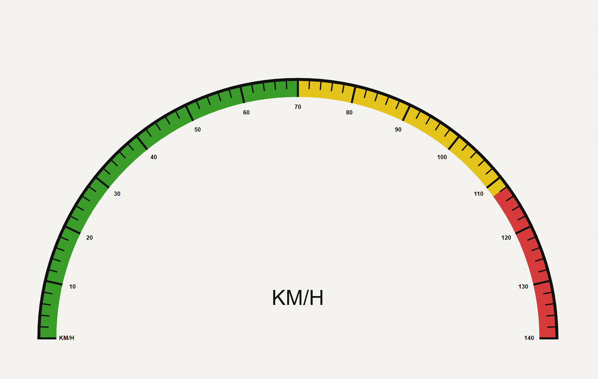
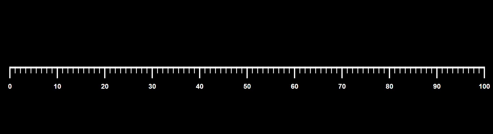
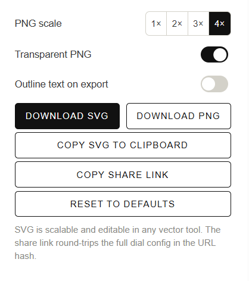

# Dials

A small browser tool for generating clean black-and-white (or colour-band-accented) dial scale graphics. Pick a shape, dial in the range and graduations, configure typography and colour zones, and download the result as a vector `.svg`, a multi-scale `.png`, or copy SVG markup straight to the clipboard.



**Live:** https://artofpilgrim.github.io/Dials/

## Features

### Shape & layout
- **Shapes** — straight line (horizontal or vertical), semi-circle, custom arc (any start angle + sweep), full circle.
- **Reverse direction** — flip the value mapping for counter-clockwise reading or max-at-start straight lines.
- **Pivot is anchored to the canvas centre** for arc / circle so tweaking start / sweep rotates the dial in place instead of shifting the whole composition. Semi-circles anchor at the bottom so the arc fills the canvas upward.
- **Self-correcting orientation toggle** on the straight dial — clicking Horiz. / Vert. places the longer canvas dimension on the active axis, so the canvas never ends up squished against the rendering.

### Range & graduations
- Set min/max, major step, and **subdivisions** (minor ticks between adjacent majors).
- Tick values round relative to `min` (e.g. range `3–23` step `10` yields `3, 13, 23`, not `0, 10, 20`).
- **Tick length is the visible length past the rim edge** — changing rim thickness no longer eats into the visible tick.
- **Corner radius** on tick ends (0–100 %), with a **Round both ends** toggle. The rim-side end stays square by default so a thin rim still meets the tick cleanly.
- Separate major / minor length, weight controls; all are purely cosmetic and don't shrink the dial.

### Rim & colour band
- **Rim** on/off with adjustable thickness. Tick endpoints extend through the rim so corners close flush instead of leaving a notch; the rim draws **after** the ticks so back-extensions stay hidden behind it.
- **Colour band** (zone indicator) — up to 6 user-defined colour zones with a `{ color, endValue }` data model. Inner / outer position relative to the rim, adjustable thickness, configurable **start / end value range** (defaults to full dial range), and a stacked preview bar that updates live as you edit. Four built-in presets (Traffic light, Warning, Cool, Mono) re-scale to your current range on insert.

### Numbers & typography
- Toggle, size, offset, weight (100–900), unit suffix (e.g. `°`, `%`, `mph`), and per-tick custom labels (`L, M, H` …) that override the numeric value at any index.
- **Typography section** — font picker with Helvetica plus four curated Google Fonts (Inter, IBM Plex Mono, JetBrains Mono, Space Mono). Fonts are loaded on demand via a `<link>` injected into `<head>`. The chosen family applies to tick numbers, custom labels, and the centre title text.
- For arc dials: **Tick direction** (inward / outward / both) and **Number placement** (inside / outside) are decoupled from layout — flipping either is purely cosmetic, the rim radius doesn't shift.

### Center (arc / semi / circle)
- Optional **hub dot** with adjustable size.
- Optional **title text** with its own size, weight, and vertical offset so it can clear the hub.

### Invert
- Renders white-on-black; flows through to the exports. The colour band keeps its user-defined colours regardless.



### Canvas
- Manual width / height (capped at 8192 px each) plus one-click texture sizes (512 / 1024 / 2048) for Substance Painter and other PBR workflows.

### Presets
- Save the current configuration to `localStorage` and reload it later.
- Older presets auto-migrate as the schema evolves (`minorStep` → `subdivisions`, etc.).

### Shareable links
- Every config change is encoded into the URL `#hash`; sharing the URL reproduces the exact dial.
- `hashchange` is honoured so back / forward and pasted URLs work, and clearing the hash resets to defaults.
- A dedicated **Copy share link** button writes the live URL to the clipboard.

### Preview
- Mouse-wheel zooms at the cursor; click-drag pans; on-screen `−` / % / `+` / Fit controls.
- The preview wrapper is sized via `ResizeObserver` so the canvas always fills the available stage area while preserving its aspect ratio.

### Export



- **Download SVG** — vector, editable in any vector tool.
- **Download PNG** at **1× / 2× / 3× / 4×** the canvas resolution.
- **Transparent PNG** toggle forces an alpha-channel PNG regardless of the dial's background colour — useful for compositing into Painter / Figma.
- **Outline text on export** — replaces every `<text>` element with a vector `<path>` (via opentype.js) so the receiver of the file doesn't need the font installed. opentype.js and the TTF are lazy-loaded only when the user actually exports with outlining on, so the main bundle stays small.
- **Copy SVG to clipboard** — paste straight into Figma / Illustrator without round-tripping through the filesystem.

<br clear="all" />

### Sidebar UX
- **Collapsible sections** — click a heading to fold it; open/closed state persists per section in `localStorage`.
- **Editable slider values** — every slider has an inline numeric input next to its label. Values are clamped to the slider's range on commit; intermediate keystrokes don't poison the renderer.

## Local development

```bash
npm install
npm run dev      # http://localhost:5173
npm run build    # produces dist/
npm run preview  # serves dist/ for sanity checking the build
```

## Project structure

```
.
├── index.html              # Vite entry; lean shell + <noscript> fallback
├── src/
│   ├── main.jsx            # ReactDOM root
│   ├── App.jsx             # State, controls, presets, zoom, export
│   ├── Dial.jsx            # SVG renderer (straight + arc + circle + colour band)
│   └── styles.css          # All styles
├── vite.config.js          # base: '/Dials/' for the GitHub Pages subpath
├── .github/workflows/
│   └── deploy.yml          # Builds with Vite, publishes via actions/deploy-pages
└── package.json
```

## Deployment

Every push to `main` triggers a GitHub Action that runs `npm ci && npm run build` and publishes `dist/` via the official `actions/deploy-pages` workflow. Pages is configured with `build_type: workflow` (set once via the GitHub API; not stored in the repo).

If you fork this and want to deploy under a different repo name, change the `base` in [vite.config.js](vite.config.js) to match your new subpath (e.g. `/your-repo-name/`).

## Notes

- Stack: React 18 + Vite. The original prototype loaded React + Babel-standalone from a CDN; the Vite build cut the runtime from ~3 MB to ~60 KB gzipped (plus a separate ~68 KB chunk for opentype.js that only loads when the user enables outline-on-export).
- The renderer is pure SVG — no canvas, no third-party drawing library at runtime.
- The tick loop is hard-capped at 5000 ticks to keep misconfigured ranges from freezing the UI, and `min`/`max` are coerced to numbers with a fallback span so equal or inverted ranges never produce NaN coordinates.
- The preview wrapper is sized via `ResizeObserver` so the canvas always fills the available stage area while preserving its aspect ratio.
- Persisted storage:
  - `dialMaker.presets.v1` — saved presets (view state — zoom / pan — is intentionally not stored).
  - `dialMaker.section.<id>` — open/closed state per sidebar section.
- URL hash format: only fields that differ from `DEFAULTS`, written as short-key URL params via `URLSearchParams` (e.g. `#s=arc&sa=135&sw=270`). A default dial has no hash at all. Legacy base64-JSON hashes still decode for backward compatibility with older shared links. The colour-band zones array uses a custom compact `color:value,color:value` encoding rather than nested JSON.
- Any state loaded from the hash or a preset goes through a sanitizer before reaching the renderer:
  - **Numbers** are coerced to finite values and clamped to the same range as the matching UI control. Non-finite values fall back to `DEFAULTS`.
  - **Enum fields** (`shape`, `tickDirection`, `numberPlacement`, `orientation`, `tickSide`, `bg`, `fontFamily`, `colorBandPosition`) are checked against an allowlist; unknown values fall back.
  - **`tickColor`** must match `^#[0-9a-f]{6}$`; anything else falls back.
  - **Booleans** accept strict `true` / `false` only. The hash encoding is `1` / `0`; any other value leaves the field unset so `DEFAULTS` wins.
  - **Free-form strings** (`numberSuffix`, `customLabels`, `centerText`) are type-checked and soft-capped at 32 / 1024 / 256 characters so a maliciously long hash can't stall the renderer.
  - **Colour-band zones** are validated for monotonic stops, valid `#rrggbb` colours, and that the final stop reaches `max`. Zones outside the band's `[start, end]` range are clipped at render time.
</content>
